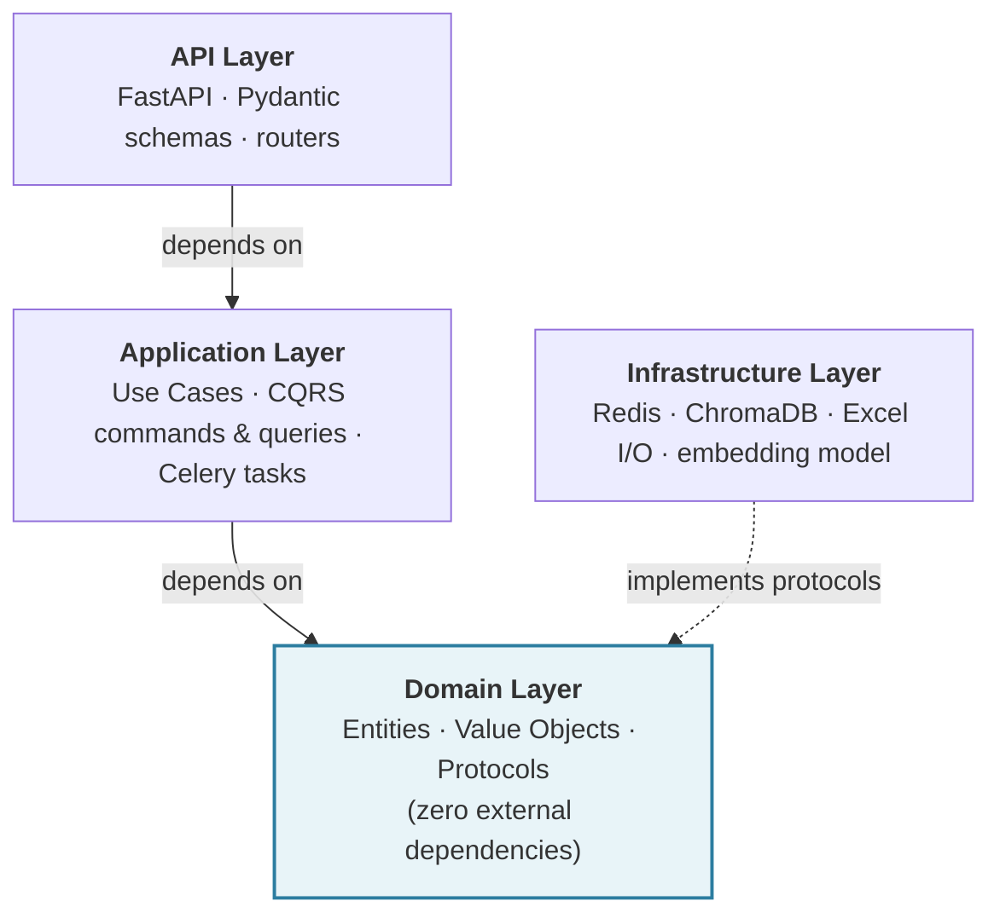
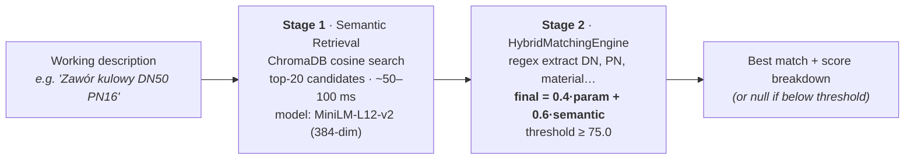

# FastBidder 3.0

> Automating the 8-hour Excel pricing workflow in HVAC contracting — a domain-built hybrid matching engine in Python.

[](https://www.python.org/)
[](https://fastapi.tiangolo.com/)
[](https://docs.celeryq.dev/)
[](https://redis.io/)
[](https://www.trychroma.com/)
[](tests/)
[](tests/)
[](LICENSE)

---

## About

In Polish mechanical-installation contracting, pricing a single bid means manually cross-referencing
hundreds of HVAC items against years of past supplier quotes — Excel-against-Excel, line by line.
A typical request-for-quote runs 8 hours of clerical work before the engineer can think about margins.

FastBidder turns that workflow into a single API call: upload the items to price, upload the
supplier catalog, get an Excel back with prices written in.

**Built by [Piotr Motyl](https://www.linkedin.com/in/piotr-motyl-634491257/) — formerly 15 years
as a mechanical-installation site manager, now in transition into AI engineering.** This project
sits at the intersection: the matching problem is one Piotr lived through firsthand, and the
solution is engineered from inside the domain rather than guessed at from the outside.

The codebase is a portfolio piece for senior engineering practices (Clean Architecture, CQRS,
two-stage retrieval, evaluation framework), framed around a real domain problem rather than
a tutorial dataset.

---

## Why This Project Is Interesting

Five things that distinguish this from a typical junior portfolio repo:

1. **Hybrid matching — not pure ML, not pure rules.** Stage 1 narrows the reference catalog to
   top-20 candidates via cosine similarity over multilingual embeddings; Stage 2 scores those
   candidates with a regex-extracted parameter score (40%) blended with the semantic score (60%).
   Each match carries a defensible breakdown — no black box.
   See [src/domain/hvac/value_objects/match_score.py:172](src/domain/hvac/value_objects/match_score.py#L172).

2. **Anti-hallucination by design.** The dependency tree contains zero generative LLMs — only
   `sentence-transformers` for retrieval embeddings. When matching a 12 000 PLN industrial valve,
   a confabulated answer is a financial liability. The matching engine is deterministic and
   auditable. Verifiable in [pyproject.toml](pyproject.toml).

3. **Clean Architecture + CQRS at MVP scale.** Domain layer has zero infrastructure imports
   (Protocol-based dependency inversion); writes go through `ProcessMatchingCommand`, reads
   through `GetJobStatusQuery`. Conscious over-engineering, chosen for the learning value and
   to keep write/read scaling decisions independent later.
   See [src/application/commands/](src/application/commands/) and [src/application/queries/](src/application/queries/).

4. **Multilingual embeddings (Polish / English).** The model
   `paraphrase-multilingual-MiniLM-L12-v2` (384-dim, ~420 MB) handles `mosiądz` ↔ `brass`,
   `kulowy` ↔ `ball valve`, `cyrkulacyjna` ↔ `obiegowa` in the same vector space — no manual
   synonym dictionary maintained.
   See [src/infrastructure/ai/embeddings/embedding_service.py:52](src/infrastructure/ai/embeddings/embedding_service.py#L52).

5. **Retrieval-quality evaluation framework.** Recall@K, Precision@1, and Mean Reciprocal Rank
   are wired in, with metrics broken down by item difficulty. The framework is the non-negotiable
   prerequisite for tuning thresholds against real-world data once collection completes.
   See [src/domain/hvac/evaluation/evaluation_runner.py:110-134](src/domain/hvac/evaluation/evaluation_runner.py#L110-L134).

---

## Tech Stack

| Technology | Role |
|---|---|
| **FastAPI 0.104 + Pydantic v2** | REST API with automatic schema validation and Swagger UI |
| **Celery 5.3 + Redis 7** | Async task queue; per-item job progress tracked in Redis |
| **ChromaDB 1.4 + sentence-transformers** | Vector store + multilingual embeddings (384-dim, Polish / English) |
| **Polars** | Columnar Excel parsing (chosen over Pandas for speed and stricter typing) |
| **openpyxl** | Excel output with color-coded match-quality indicators |
| **Docker + Docker Compose** | Containerised Redis and Flower monitoring |
| **Poetry + pytest** | Dependency management; 896 unit tests, 88% coverage |

---

## Architecture

### Clean Architecture — Four Layers



The Domain layer holds the business rules — `HVACDescription` entity, `MatchScore` value object,
`ParameterExtractorProtocol`, `MatchingEngineProtocol` — and imports nothing from outer rings.
Infrastructure adapters (ChromaDB client, Redis progress tracker, Polars-backed Excel reader)
implement the Protocols defined in Domain. The dependency rule is enforced by code review and
by the test suite running the Domain in full isolation (no Docker, no network).

CQRS lives at the Application boundary: `ProcessMatchingCommand` carries the write path
(file IDs, threshold, strategy); `GetJobStatusQuery` carries the read path
(`job_id` only, frozen Pydantic model). This is conscious over-engineering for an MVP — the
payoff is in legibility and in keeping write/read scaling decisions independent later.

---

## How It Works — Two-Stage Matching



**Stage 1 — narrow the search space.** The query text is embedded, cosine-searched against
the persisted reference catalog in ChromaDB, and the top-20 candidates are returned. This step
exists because Stage 2 scoring is too expensive to run against every reference item; embedding
similarity is cheap, and 20 candidates is enough for the precise scorer to find the correct
match in practice.

**Stage 2 — score and decide.** Each candidate gets a parameter score (regex extraction of
DN, PN, material, valve type, drive type, voltage, manufacturer) and a semantic score. The
final score is a weighted blend, and matches below the threshold (default 75.0) are rejected
rather than guessed at.

### The Scoring Formula

The single defining line of the engine, taken verbatim from
[match_score.py:172](src/domain/hvac/value_objects/match_score.py#L172):

```python
return 0.4 * self.parameter_score + 0.6 * self.semantic_score
```

The 60/40 split favours semantic similarity for domain language flexibility (the model handles
synonyms like `mosiądz` / `mosiężny`), while the 40% parameter weight protects against the
classic embedding failure: embeddings happily rank `DN50 PN16` close to `DN65 PN10` despite
the items being mechanically incompatible. The regex layer is the hard constraint; the
embedding is the soft one.

### Parameter Weights (within the 40% parameter score)

From [matching_config.py:35-41](src/domain/hvac/matching_config.py#L35-L41):

| Parameter | Weight | Why this weight |
|---|---|---|
| **DN** (Diameter Nominal) | 35% | Mechanical compatibility hinges on it — DN mismatch triggers fast-fail |
| **Material** | 20% | `mosiądz` vs `stal` — different price tier, different application |
| **Valve type** | 15% | `kulowy`, `zwrotny`, `grzybkowy` — functional category |
| **PN** (Pressure Nominal) | 10% | Important but more often interchangeable across catalog grades |
| **Drive type** | 10% | `ręczny` / `elektryczny` / `pneumatyczny` |
| **Voltage** | 5% | Only meaningful for electric drives |
| **Manufacturer** | 5% | Bonus signal — helps disambiguate near-ties |

The default threshold of `75.0` is set in
[matching_config.py:67](src/domain/hvac/matching_config.py#L67) and is overridable per-request
via the `matching_threshold` field on `ProcessMatchingCommand` — the final calibrated value is
expected to shift once the framework runs against real-world data.

---

## Quick Start

**Prerequisites:** Python 3.10+, Docker, Poetry 1.5+

```bash
# 1. Clone and install
git clone https://github.com/Piotr-Motyl/FastBidder3.0.git
cd FastBidder3.0/source_code/fastbidder
make install

# 2. Configure environment
cp .env.example .env

# 3. Start Redis (and Flower at :5555)
make docker-up

# 4. Start API and worker (two terminals)
make run                      # terminal 1 → http://localhost:8000/docs
make celery-worker            # terminal 2
```

> **Verify:** `docker exec fastbidder_redis redis-cli PING` → `PONG`
>
> **API docs:** Swagger UI auto-generated at `http://localhost:8000/docs`
>
> **First-run note:** the embedding model downloads ~420 MB on first matching call (cached afterwards).

---

## API

| Method | Endpoint | Description | Returns |
|---|---|---|---|
| `GET` | `/health` | Health check for monitoring and load balancers | `{"status":"ok",...}` |
| `POST` | `/api/files/upload?file_type=reference` | Upload supplier catalog Excel | `file_id` (UUID) |
| `POST` | `/api/files/upload?file_type=working` | Upload items-to-match Excel | `file_id` (UUID) |
| `POST` | `/api/matching/process` | Trigger async matching job | `job_id`, HTTP 202 |
| `GET` | `/api/jobs/{job_id}/status` | Poll progress 0–100% | `status`, `progress` |
| `GET` | `/api/results/{job_id}/download` | Download matched result | `.xlsx` file |

**Example — `POST /api/matching/process`:**

```json
{
  "working_file": {
    "file_id": "a3bb189e-8bf9-3888-9912-ace4e6543002",
    "description_column": "C",
    "description_range": { "start": 2, "end": 101 },
    "price_target_column": "F",
    "matching_report_column": "G"
  },
  "reference_file": {
    "file_id": "f47ac10b-58cc-4372-a567-0e02b2c3d479",
    "description_column": "B",
    "price_source_column": "D"
  },
  "matching_threshold": 75.0
}
```

Full schema and try-it-out interface available at `/docs` once the API is running.

---

## Testing

```bash
make test-unit          # 896 unit tests       · no Docker required · ~95 s
make test-integration   # integration tests    · real ChromaDB + Redis · requires `make docker-up`
make test-e2e           # E2E tests            · full Celery workflow · requires worker running
make test-ci            # strict mode with coverage threshold ≥ 80%
```

| Layer | Coverage | Notes |
|---|---|---|
| Domain | 95%+ | Pure business logic, zero external dependencies |
| Infrastructure | ~89% | AI pipeline, file storage, Redis adapters |
| Application | ~88% | Use cases, Celery task, CQRS handlers |
| API | 48–64% | HTTP layer, routers, schemas (intentionally lower — coverage shifts to integration tests) |

**Verified via `make test-unit`: 896 passed, 88% overall coverage in 94.9 s.**

---

## Project Status & Roadmap

**Stage:** PoC → MVP transition. No real production users yet — by design.

### What works end-to-end

- Excel upload (working file + reference catalog) with column-mapping metadata
- Async matching job triggered via REST, tracked per-item in Redis
- Two-stage retrieval pipeline: ChromaDB top-20 → hybrid scoring → threshold filter
- Excel output with prices written back and color-coded match quality
- Full `/health` → upload → process → poll → download happy path validated by integration tests

### Honest disclosures

- **Golden dataset is small.** 5 synthetic Polish HVAC pairs in
  [tests/fixtures/sample_golden_dataset.json](tests/fixtures/sample_golden_dataset.json) (easy /
  medium / hard difficulty). Real-world data collection from installation contractors is
  in progress; calibration of threshold and weights against that data will follow.
- **Two E2E tests are skipped.** The 100-item performance test is blocked by a ChromaDB SQLite
  file lock on Windows/WSL2 ([tests/e2e/test_performance.py](tests/e2e/test_performance.py));
  a data-variations test is a placeholder for post-MVP scale work
  ([tests/e2e/test_happy_path_data_variations.py](tests/e2e/test_happy_path_data_variations.py)).
  Both are documented in the test files — not silently ignored.
- **No CI pipeline yet.** The `.github/workflows/` directory is empty;
  testing runs locally via `make test-ci`. Adding GitHub Actions is the next priority.
- **No production deployment.** Local Docker Compose only — no Render / Railway / cloud target wired in.

### What's next (priority order)

1. Collect 50–100 real working/reference pairs from installation contractors;
   re-run `make evaluate` against them and tune threshold + parameter weights
2. GitHub Actions CI: run `make test-ci` on every PR, gate merges on the 80% coverage threshold
3. Migrate stdlib `logging` to `structlog` with per-request `trace_id` propagation through Celery
4. Cloud deployment (Render or Railway) for live demo URL

---

## Project Structure

```
src/
├── api/                # Presentation — FastAPI routers + Pydantic schemas
├── application/        # Use Cases — ProcessMatchingCommand, GetJobStatusQuery, Celery tasks
├── domain/hvac/        # Business Logic — HVACDescription, MatchScore, Protocols, MatchingConfig
└── infrastructure/     # Adapters — ChromaDB client, Redis tracker, Excel I/O, HybridMatchingEngine

tests/
├── unit/               # 896 tests · isolated, no external deps · ~95 s
├── integration/        # real sentence-transformers + ChromaDB
└── e2e/                # full Celery workflow (requires docker-up + celery-worker)
```

The full architecture rule — *Domain imports nothing from Infrastructure* — is enforced
in code review. Curious readers can verify by grepping the Domain layer:

```bash
grep -r "from src.infrastructure" src/domain/   # should return nothing
```

---

## Contact

**Piotr Motyl** — Python developer in transition into AI engineering. Previously 15 years
in mechanical installation contracting (site manager); the domain context for this project
comes from there directly.

- [LinkedIn](https://www.linkedin.com/in/piotr-motyl-634491257/)
- [GitHub @Piotr-Motyl](https://github.com/Piotr-Motyl)
- motyl.piotr.it@gmail.com

Open to AI / Backend engineering roles in PL / EU. Happy to walk a hiring manager
through the matching engine, the architectural choices, or the domain reasoning behind any
of them.

---

## License

MIT — see [LICENSE](LICENSE).

---

*If this project is interesting or useful, a star on GitHub is appreciated.*
